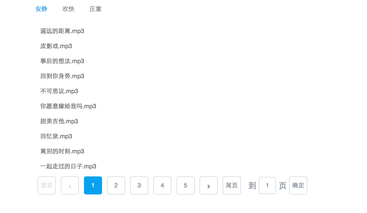

# Vue Pagination

vue分页组件, 同时支持数据缓存

[Vue.js](http://vuejs.org/) (基于 2.1.0)

##demo

详情请看example




## 安装

```bash
npm install vuejs-pagination --save-dev
```

## 基本用法

```html
<body id="app">
    <pagination
        :page-num="pageNum"            //总页码， 必须
        :actived-page="activePage"    //当前页， 必须
        v-on:change="change">        //触发事件, 必须
    </pagination>
</body>
```

```javascript
import Pagination from 'vuejs-pagination'
new Vue({
    el: '#app',
    data:function() {
        return{
            pageNum : 1, //总页数， 默认1
            activePage : 1 //当前页， 默认1
        }
    },
    mounted : function(){
        this.getData();
    },
    methods:{
        getData : function(){
            $.ajax({
                url : 'xxx',
                data  :{
                    activePage : this.activePage
                },
                success : function(rs){
                    this.pageNum = rs.pageNum;
                }
            })
        },
        change:function(value){
            this.activePage = value;    //
            this.getData();
        }
    }
})
```

## 高级用法

缓存功能

```html
<pagination
    :types="types"                 //该接口类型
    :cache-list="list"             //需要缓存的内容
    :page-num="pageNum"            //总页码
    :active-page="activePage"     //当前页
    v-on:change="change">        //页码变化触发事件
</pagination>
```

```javascript
//翻页后请求接口前， 先获取缓存数据， 如果没有， 再调用接口
this.$nextTick(() => {
    const cache = this.$refs.page.getCache();
    if (cache) {
        this.musicList = cache;
        return;
    }
    $.ajax({
        url : 'xxx'
    })
}
```

# Options

Name                | Default                  | Required | Description
:------------------ | :----------------------- | :------- | :-----------
pageNum             | 1                        | true     | 总页码
activePage          | 1                        | true     | 当前页
pageSize            | 5                        | false    | 显示几页
cacheList           |                          | false    | 需要缓存的数据
types               |                          | false    | 需要缓存数据的类型
wrapperClass        | vue-pagination-container | false    | 根元素的class
prevItemClass       | vue-pagination-prev      | false    | 上一页按钮的class
vue-pagination-next | vue-pagination-next      | false    | 下一页按钮的class
pageItemClass       | vue-pagination-item      | false    | 页码item的class

# Emit

Name   | Params          | Required | Description
:----- | :-------------- | :------- | :-------------
change | newIndex(点击的哪页) | true     | 当点击其他页时，会触发该方法
